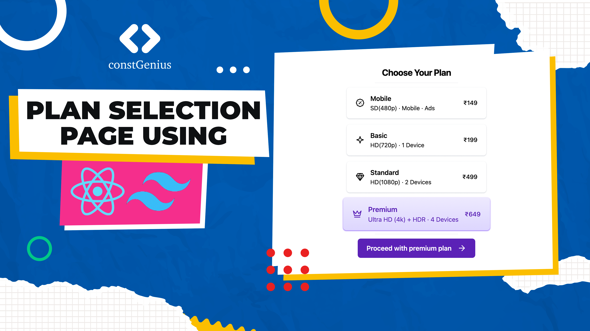

# Plan Selection Page using React and Tailwind CSS | Build a Pricing Page with React

A Plan Selection Page crafted with React and Tailwind CSS offers an intuitive and visually appealing interface for users to explore and choose from various subscription or service plans. Leveraging React's dynamic components and Tailwind CSS's utility-first approach, the page delivers a responsive and well-styled design. Users can easily compare plan details, make selections, and interact with elements, providing a seamless and user-friendly experience. This combination of technologies ensures a modern and efficient solution for presenting and selecting plans, contributing to a positive user journey.

Youtube Tutorial Link: https://youtu.be/7hDQuljQcIo

